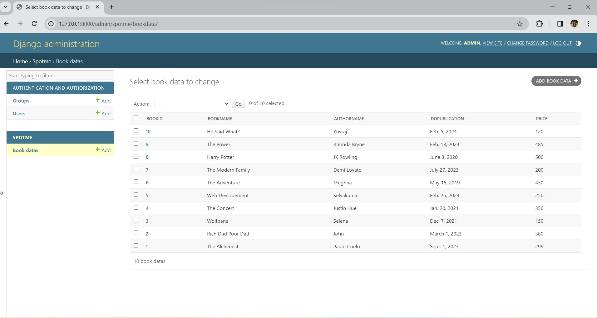

# Ex02 Django ORM Web Application
## Date: 29-02-2024

## AIM
To develop a Django application to store and retrieve data from a Book database using Object Relational Mapping(ORM).

## Entity Relationship Diagram


## DESIGN STEPS

### STEP 1:
Clone the problem from GitHub

### STEP 2:
Create a new app in Django project

### STEP 3:
Enter the code for admin.py and models.py

### STEP 4:
Execute Django admin and create details for 10 books

## PROGRAM

```
models.py

from django.db import models
from django.contrib import admin
class BookData(models.Model):
	bookID=models.IntegerField(primary_key=True);
	bookname=models.CharField(max_length=50);
	authorname=models.CharField(max_length=50);
	dopublication=models.DateField();
	price=models.IntegerField();
class BookDataAdmin(admin.ModelAdmin):
	list_display=("bookID","bookname","authorname","dopublication","price");

admin.py

from django.contrib import admin
from .models import BookData,BookDataAdmin
admin.site.register(BookData,BookDataAdmin)
```

## OUTPUT




## RESULT
Thus the program for creating a database using ORM hass been executed successfully
